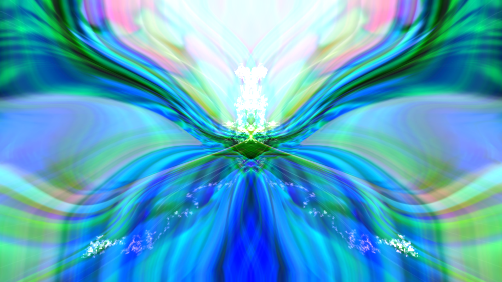
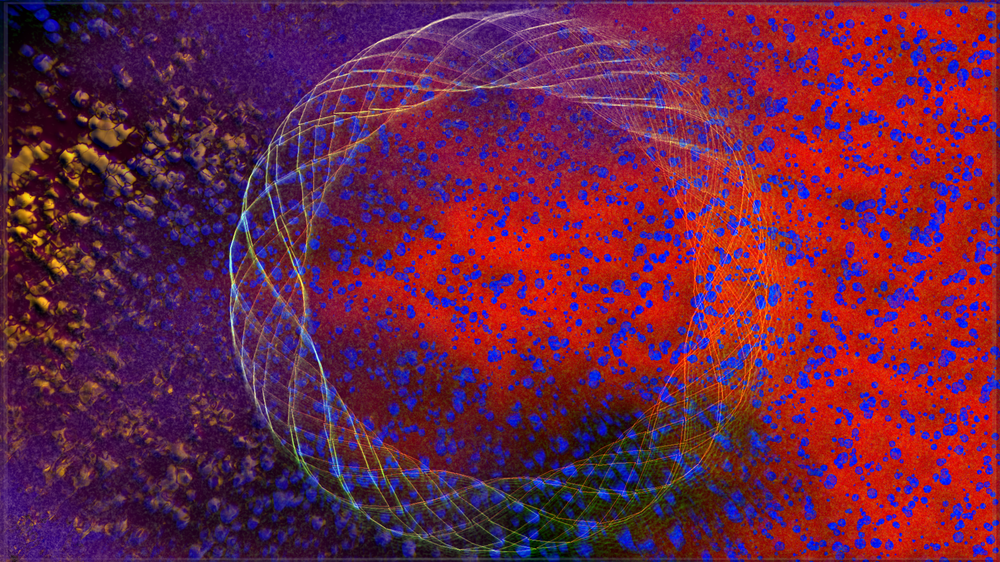
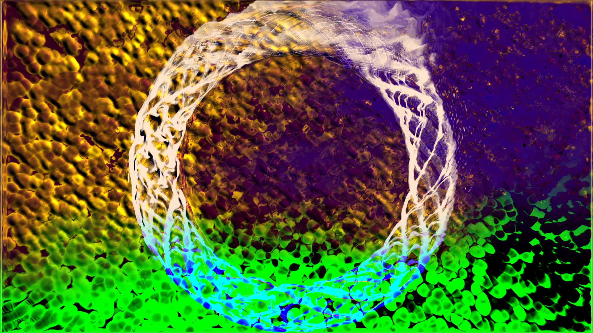
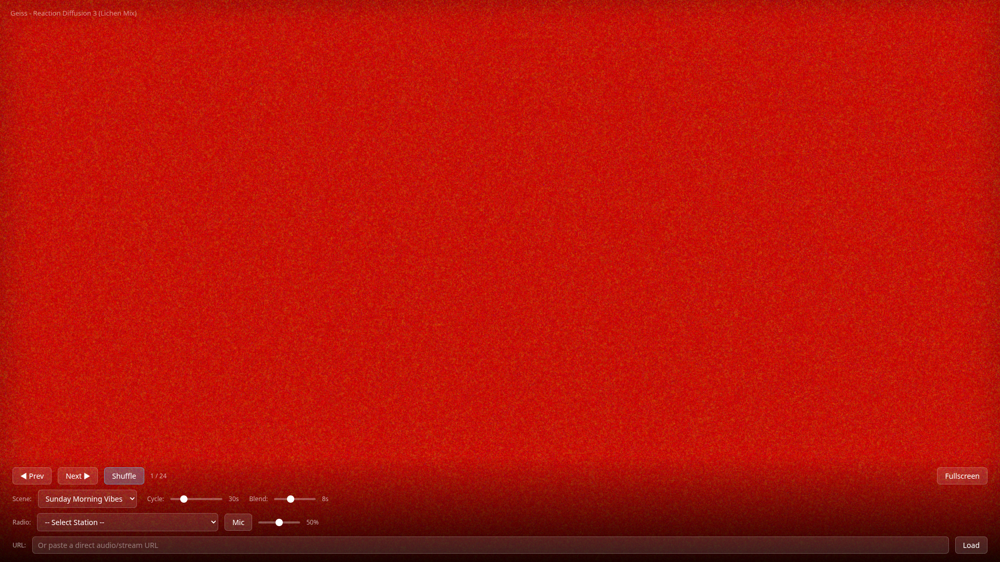

<p align="center">
  
</p>

<h1 align="center">
  🌅 LappyCap
</h1>

<p align="center">
  <strong>A browser-based music visualizer that turns your screen into a lava lamp from the future.</strong>
</p>

<p align="center">
  
  
  
  
  
  
</p>

<p align="center">
  <a href="https://tangelis.github.io/lappycap/"><strong>▶️ Launch LappyCap</strong></a>
</p>

<p align="center">
  <em>Entirely original. Not even a little bit inspired by anything that may or may not have existed inside Winamp.</em>
</p>

---

## What is this?

LappyCap is a **real-time music visualizer** that runs in your browser. It reacts to audio using WebGL shaders, rendering psychedelic, fluid, organic visuals that pulse and morph with the music. Think of it as a screensaver that went to art school and came back with opinions about frequency response.

It features a **scene system** — curated collections of visual presets that you can cycle and crossfade between. The first scene, **Sunday Morning Vibes**, is tuned for mellow ambient, funk, and electronic music in the 90-120 BPM range. Sunrise gradients, liquid motion, oil-on-water projections, and that general "I woke up and the world is beautiful" energy.

<p align="center">
  
  &nbsp;
  
</p>

## Features

🎨 **367 Visual Presets** — A massive library of GPU-accelerated shader presets, from gentle ripples to full cosmic meltdown

🎭 **Scene System** — Curated preset collections with auto-cycling and smooth crossfade blending between presets

📻 **16 Built-in Radio Stations** — SomaFM integration (Groove Salad, Lush, Deep Space One, Drone Zone, and more) — just pick a station and vibe

🎤 **Microphone Input** — Visualize whatever's playing in the room, feedback-free (output is muted, analyser still gets data)

🔗 **Custom Audio URLs** — Paste any CORS-friendly audio stream

⌨️ **Keyboard Shortcuts** — `n`/`p` next/prev, `f` fullscreen, `s` shuffle, arrow keys

🖥️ **Fullscreen Mode** — Controls auto-hide after 4 seconds, reappear on mouse movement

📺 **Chromecast** — Full Cast support with a persistent Cast session chip on desktop, richer TV receiver overlays, and phone control via `/remote.html`; visuals run natively on Chromecast/Android TV

<p align="center">
  
</p>

## Quick Start

```bash
git clone https://github.com/tangelis/lappycap.git
cd lappycap
npm install
npm run dev
```

Open `http://localhost:5173` in your browser. Click anywhere to start. Pick **Groove Salad** from the Radio dropdown. Fullscreen it. You're welcome.

## Sunday Morning Vibes 🌄

The debut scene includes 24 hand-picked presets selected for their smooth, organic, flowing aesthetics:

| Vibe | Presets |
|------|---------|
| 🌊 **Fluid / Organic** | Infused with the spiral, Alien fish pond, Jelly fish mandala |
| 🌅 **Warm / Glowing** | Airhandler (Last Breath), Songflower, Mother-of-pearl, Toffee cream |
| 🌀 **Spirals** | Predator-prey spirals, Swing out on the spiral, Spiral Artifact |
| 🎨 **Painterly** | Painterly Tendrils, Canvas Mix, Cauldron painterly |
| 🚀 **Atmospheric** | Astral projection, Cascading decay swing, A Million Miles From Earth |

## Radio Stations 📻

All stations courtesy of [SomaFM](https://somafm.com) — listener-supported, commercial-free internet radio.

| Station | Genre | Perfect For |
|---------|-------|-------------|
| 🥗 Groove Salad | Ambient / Chill | Sunday mornings, obviously |
| 🌿 Lush | Electronic / Mellow | Late night coding |
| 🌌 Deep Space One | Deep Ambient | Staring into the void |
| 🌫️ Drone Zone | Atmospheric Ambient | Meditation or pretending to meditate |
| 🛸 Space Station Soma | Mid-tempo Electronic | Productive procrastination |
| 🎸 Left Coast 70s | Funk / Soul | When you need a groove |
| 💿 Underground 80s | New Wave / Synth | Retrofuturism |
| 🎧 The Trip | Progressive Electronic | Long drives |
| 🎹 Fluid | Instrumental Hip-Hop | Head nodding |
| 💀 DEF CON Radio | Electronic / Hacker | When you're in the zone |
| 🤠 Boot Liquor | Americana / Roots | Plot twist vibes |
| 🔊 cliqhop idm | IDM / Glitch | Pretending to understand IDM |
| 🎷 Sonic Universe | Jazz / Fusion | Feeling sophisticated |
| 🍸 Illinois Street Lounge | Lounge / Exotica | Tiki bar energy |
| 🌆 Vaporwaves | Vaporwave / Future Funk | A E S T H E T I C |

## Architecture

```
┌─────────────────────────────────────────────┐
│              Browser                         │
│                                              │
│  Audio URL ──→ <audio> ──→ Web Audio API     │
│       or                    AnalyserNode     │
│  Microphone ──→ MediaStream ──↗    │         │
│                                    ↓         │
│  Scene Manager ──→ Preset ──→ Butterchurn    │
│  (cycle/blend)     Loader    WebGL Renderer  │
│                                    │         │
│                              ┌─────┘         │
│                              ↓               │
│                         Canvas (GPU)         │
└─────────────────────────────────────────────┘
```

- **Audio**: Web Audio API `AnalyserNode` provides real-time FFT frequency data
- **Rendering**: [Butterchurn](https://github.com/jberg/butterchurn) — a WebGL port of the classic Milkdrop visualization engine
- **Presets**: 367 community-created visual presets from the butterchurn ecosystem
- **Build**: Vite 8 + TypeScript for fast development and optimized production builds

## Keyboard Shortcuts

| Key | Action |
|-----|--------|
| `n` or `→` | Next preset |
| `p` or `←` | Previous preset |
| `f` | Toggle fullscreen |
| `s` | Toggle shuffle |
| `Esc` | Show controls |

## Building for Production

```bash
npm run build    # Output in dist/
npm run preview  # Preview production build locally
```

## Testing

```bash
npm run dev &                    # Start dev server
node test-runtime.mjs            # Run headless Chromium tests
```

The test suite uses Puppeteer with headless Chromium to verify:
- Page loads and initializes correctly
- All 367 presets load from the three butterchurn packs
- Scene presets match (24/24 for Sunday Morning Vibes)
- Butterchurn WebGL renderer initializes
- Controls (next/prev, shuffle, sliders) work
- Radio station selector is populated

## Roadmap

- [x] 📺 Chromecast support (Cast sender + custom receiver)
- [ ] 🎭 More scenes (Late Night Drive, Deep Focus, Dance Floor)
- [ ] 📝 Custom scene editor (YAML-based preset files)
- [ ] 🎚️ BPM detection + auto scene matching
- [ ] 🎨 User preset favorites / blacklist
- [x] 📱 Mobile-optimized touch controls

## Credits

- [Butterchurn](https://github.com/jberg/butterchurn) by Jordan Berg — the WebGL engine that makes all of this possible
- [SomaFM](https://somafm.com) — the best internet radio you're not donating to (you should fix that)
- The entire Milkdrop preset community — decades of visual art, one shader at a time
- Absolutely nobody else. This is a completely original idea. We came up with the concept of "music + pretty shapes" independently.

## License

MIT — Do whatever you want. Make it your screensaver. Cast it to your TV. Project it on your ceiling. We don't judge.
